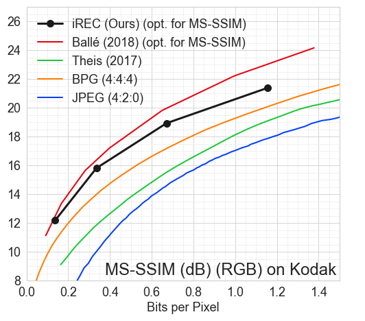

# Compressing Images by Encoding Their Latent Representations with Relative Entropy Coding

This repository is the official implementation of [Compressing Images by Encoding Their Latent Representations with Relative Entropy Coding](https://arxiv.org/anonymous). 

## Requirements
The project is structured as a python package, and should be installed as such.
Concretely, once the repository has been cloned, navigate to its root directory and using
the appropriate python environment, run

```setup
> pip install -r requirements.txt
```
### Datasets
We used the Cifar10, ImageNet32, CLIC 2018 and Kodak datasets for our experiments.
Cifar10 and ImageNet32 are readily available on `tensorflow/datasets` and will be automatically downloaded
to your computer once you run the training or evaluation code.

The CLIC 2018 dataset is available at https://data.vision.ee.ethz.ch/cvl/clic/professional_train.zip

The Kodak dataset is available at http://r0k.us/graphics/kodak/

## Project Layout
The code was written and tested using **Python 3.6**. 
The code uses the [Sacred](https://sacred.readthedocs.io/en/stable/quickstart.html) framework for running
the experiments, therefore the configuration options for any of the example files presented below can be 
displayed by running
```print_config
python <experiment_file.py> print_config
```

The project files can be found in the `rec` directory. 
In particular, the implementation of `iREC` can be found in `rec/coding`,
and the implementation of the VAE models can be found in `rec/models`.

The experiments can be found in the `examples` directory.

## Training

### RVAEs for Lossless Compression

Assuming you wish to save the model to `<model/save/path>` and the datasets should be downloaded to
`<datasets/base/path>`, to train the RVAE used in the experiments presented in the paper, run
```train
python examples/lossless/train_generative_model.py with model=resnet_vae num_res_blocks=24 \
       model_save_base_dir=<model/save/path> dataset_info.dataset_name=<cifar10/imagenet32> \
       dataset_info.dataset_base_path=<datasets/base/path> iters=500000 lamb=0.1
```

For more information on RVAEs, see [Kingma et al. (2016)](https://arxiv.org/abs/1606.04934).

### Two Level VAE for Lossy Compression
Using similar assumption about model save paths and dataset paths as above, the two level VAE used in
the paper can be trained by running
```train
python examples/lossy/train_lossy_model.py with model=large_level_2_vae \
       model_save_base_dir=<model/save/path> dataset.dataset_name=<cifar10/imagenet32> \
       dataset.dataset_base_path=<datasets/base/path> loss_fn=mse iters=200000 beta=0.01 
```

**Note:** the parameter `beta` corresponds to `lambda = {0.001, 0.003, 0.01, 0.03, 0.05}` in the paper.
For more information about the architecture and its components see 
[Ballé et al. (2016)](https://arxiv.org/pdf/1611.01704) and  [Ballé et al. (2018)](https://arxiv.org/pdf/1802.01436).

### Monitoring the Training Procedure
The training in both cases can be monitored using Tensorboard by running
```tensorboard
tensorboard --logdir <path/to/model/save/dir>
```

## Evaluation

### Lossless Compression Using the RVAE
To compress images using the settings used in the paper, run
```eval
python examples/lossless/compression_performance.py with model=resnet_vae model_save_dir=<path/to/model> \
       dataset_info.dataset_name=<dataset_name> dataset_info.dataset_base_path=<datasets/base/path> \
       dataset_info.split=test mode=compress num_test_images=1 sampler=beam_search n_beams=20 \
       extra_samples=1.2 kl_per_partition=3.
```
**Note:** `n_beams, extra_samples, kl_per_partition` correspond to `B, (1 + epsilon), Omega` in the paper, respectively.

### Lossy Compression Using the Two Level VAE
To compress images using the settings used in the paper, run
```eval
python examples/lossy/compress_with_lossy_model.py with model=large_level_2_vae model_save_dir=<path/to/model> \
       dataset.dataset_name=<dataset_name> dataset.dataset_base_path=<datasets/base/path> \
       dataset.split=test num_test_images=1 sampler=beam_search n_beams=10 \
       extra_samples=1. kl_per_partition=3.
```
**Note:** `n_beams, extra_samples, kl_per_partition` correspond to `B, (1 + epsilon), Omega` in the paper, respectively.


## Results

### Lossless Single Image Compression
In the table below, we present single image, lossless compression performance in bits per dimension (lower is better).
The best performing bits-back method is highlighted for each dataset. 
The asymptotic rates are included in parenthesis where they are different from 
the single image case. To calculate the number of bits needed for single images, 
we added the number of auxiliary bits required to the asymptotic compression rate as reported in the respective papers.

|               |             | Cifar10 (32x32) | ImageNet32 (32x32) | Kodak (768x512) |
|---------------|-------------|-----------------|--------------------|-----------------|
|               |             |                 |                    |                 |
|*Non bits-back*| PNG         | 5.87            | 6.39               | 4.35            |
|               | WebP        | 4.61            | 5.29               | 3.20            |
|               | FLIF        | 4.19            | 4.52               | 2.90            |
|               | IDF         | 3.34            | 4.18               | -               |
|               |             |                 |                    |                 |
| *Bits-back*   | LBB         | 54.96 (3.12)    | 55.72 (3.88)       | -               |
|               | BitSwap     | 6.53  (3.82)    | 6.97 (4.50)        | -               |
|               | HiLLoC      | 24.51 (3.56)    | 26.80 (4.20)       | 17.5 (3.00)     |
|               | iREC (Ours) | **4.18**        | **4.91**           | **3.67**        |
|               | ELBO (RVAE) | [3.55]          | [4.18]             | [3.00]          |

### Lossy Image Compression on Kodak


**Note:** The MS-SSIM comparisons are in decibels, calculated using the formula `-10 * log10(1 - MS-SSIM)`.
